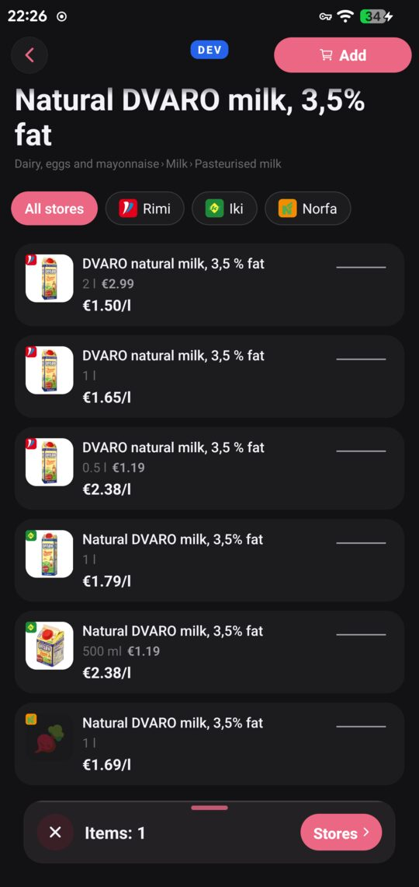
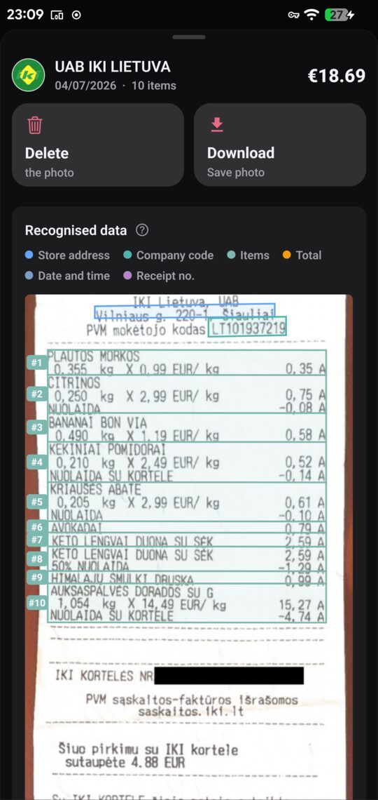
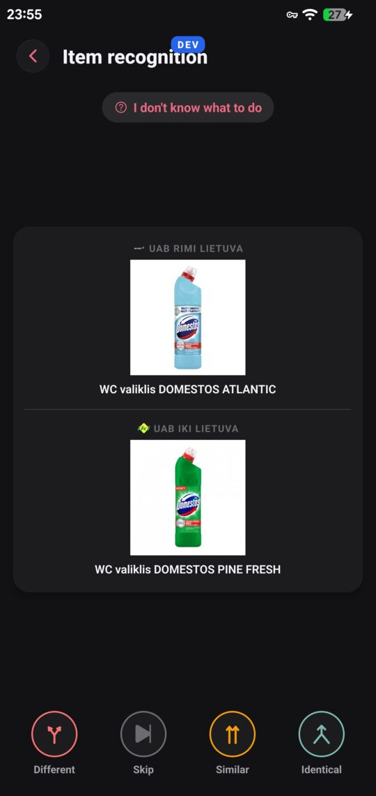
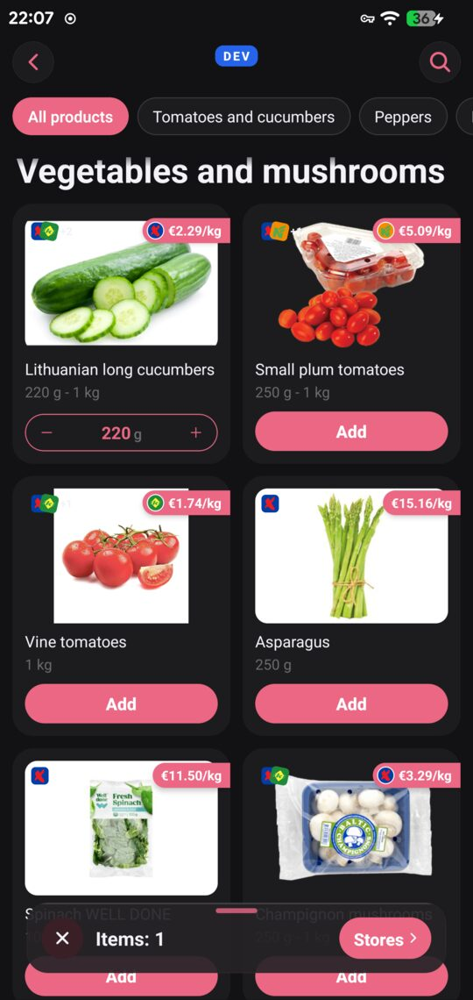
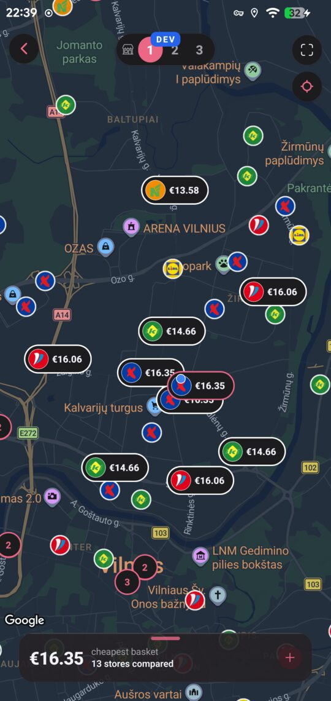
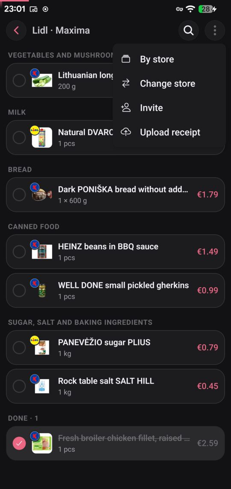
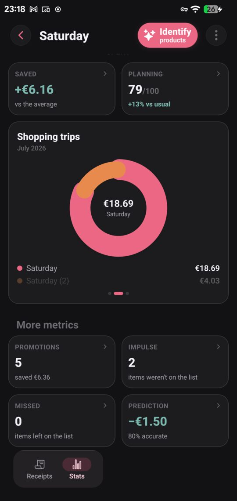
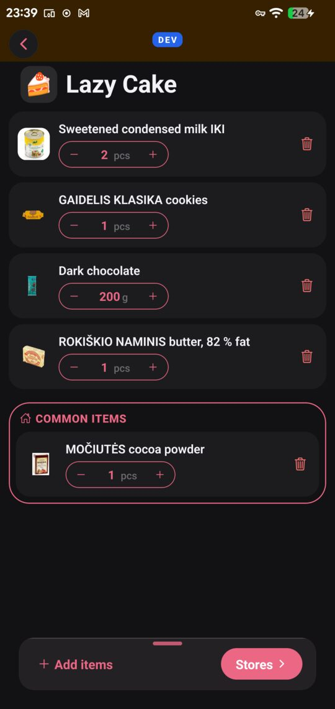
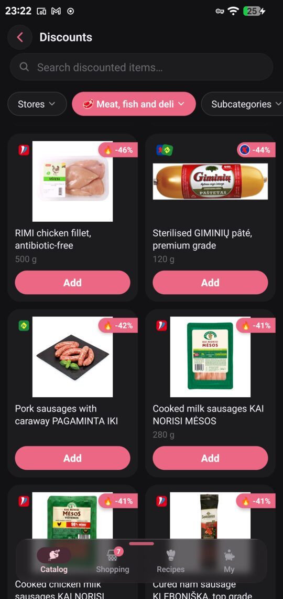

# souply-app

Grocery price comparison for Lithuania. You build a basket, the app tells you what it costs
at each shop near you, and after you've been shopping you photograph the receipt to see what
you paid against what you could have.

Five chains: Maxima, Rimi, IKI, Norfa, Lidl. None of them publish a barcode, an API, or any
shared product identifier.

<table>
<tr>
<td width="33%"></td>
<td width="33%"></td>
<td width="33%"></td>
</tr>
<tr>
<td><b>One product, every chain.</b> Six pack sizes from three shops, normalised to €/l.</td>
<td><b>Worth a second shop?</b> 150 m further for €1.29 less, priced against the alternatives.</td>
<td><b>Receipts read on the phone.</b> The parser's regions drawn back onto the photo.</td>
</tr>
</table>

> This repo is the React Native client. The backend, scrapers and matching engine are in
> [`souply-api`](https://github.com/mantasmisiun/souply-api); parsers are shared through
> [`souply-shared`](https://github.com/mantasmisiun/souply-shared).

---

## The problem

Price comparison sounds like a database join. There's nothing to join on.

No Lithuanian chain publishes an EAN. One of them exposes an `eans` field, which was empty in
all 24 records I checked. So "is this the same milk?" has to be inferred from names that
don't agree with each other:

```
Rimi   "DVARO natural milk, 3,5 % fat"     brand first, space before the %
IKI    "Natural DVARO milk, 3,5% fat"      adjective first, no space
Norfa  "Natural DVARO milk, 3,5% fat"
```

Group those successfully and you still can't compare the prices. Rimi writes `0.5 l`, IKI
writes `500 ml`, and one of them sells a 2 l carton nobody else does.

Everything below follows from those two paragraphs.

---

## Engineering

### Identity without an identifier


The six rows on the right are one product: three chains, four pack sizes, three spellings of
the same name. They're grouped by a matcher that scores name similarity, size, unit family
and price plausibility.

Two rules came out of failures rather than design. Numbers disambiguate, so 2.5% and 3.5%
milk are different products and a size mismatch is a penalty rather than noise. And matching
is zero-fallback: below the confidence threshold an item stays unmatched, because a wrong
price does more damage than a missing one.

Then look at the arithmetic. Rimi's 2 l carton works out at €1.50/l. Rimi's own 0.5 l carton
is €2.38/l, which is 59% more for identical milk. The pack prices (€2.99 and €1.19) tell you
nothing about that.

`0.5 l` and `500 ml` both resolve to €2.38/l, because size parsing reconciles the notation
before anything is compared.

<br clear="right">

### When it isn't sure, it asks



Both products here read `WC valiklis DOMESTOS`. Same brand, same type, near-identical
strings, and any similarity score will merge them. One is ATLANTIC and the other is PINE
FRESH. Merging them puts two scents under one price history and corrupts every comparison
that touches either.

Uncertain pairs go to a queue with four answers:

| | |
|---|---|
| Identical | same product, merge and share price history |
| Similar | same family, different variant, so substitutable |
| Different | unrelated |
| Skip | genuinely ambiguous, better left unresolved than guessed |

`Similar` is the one that earns its keep. It builds the substitution graph that lets saver
mode offer a cheaper equivalent when you asked for something specific. No string metric can
make that call.

<br clear="right">

### Is a second shop worth the walk?


Finding the cheapest single shop is a sort. Deciding whether to visit two needs the saving
and the detour weighed against each other, so each row carries both: amber for what it costs
you in distance, green for what it saves.

The search is a hybrid, because the two halves behave differently.

Choosing which stores to visit is exhaustive over every combination of size *k*. Adding a
store changes what every item costs, so those choices are coupled and greedy selection can
go wrong.

Choosing which store each item comes from, once the set is fixed, is greedy, and greedy is
provably optimal there. The per-item choices are independent at that point: taking the
cheapest milk can't make the bread cost more.

The candidate pool is capped per chain and by distance, which keeps `C(n,k)` small enough to
brute-force instead of approximating. A viability filter then hides splits that aren't worth
the trip, using both an absolute saving floor and a euros-per-kilometre rate.

<br clear="right">

### Receipts


OCR runs on the device (Apple Vision on iOS, ML Kit on Android), so a photo of your shopping
never has to leave the phone to be read. The loyalty card number is masked before the image
is stored.

The screenshot is the parser explaining itself: every extracted region drawn back onto the
source photo, items numbered, fields colour coded.

Band #2 shows the rule everything else depends on. Lithuanian receipts print a discount as a
separate negative line, sometimes several lines later, sometimes glued onto the next product
by bad OCR:

```
┌─ #2 ────────────────────────────────┐
│ CITRINOS                            │
│   0,250 kg X 2,99 EUR/kg   0,75 A   │
│ NUOLAIDA                  -0,08 A   │   <- inside the band
└─────────────────────────────────────┘
```

A band border is a hard wall. Content never crosses one, which is what keeps −0,08 attached
to the lemons. Every intuitive alternative I tried (sort fragments by x, attach prices by
nearest y) breaks on curved thermal paper, and it breaks by producing plausible wrong data,
which is the worst kind.

<br clear="right">

### Prices you can pay

Groceries come in discrete packages. You can't buy 300 g of a 250 g punnet, so an amount you
type gets reconciled against real pack sizes, and the app says so on the screen: *amount will
be rounded to package size*. The presets it offers are sizes the chains sell, derived from
the same parsing that produces €/kg.

The recipe importer works on the same principle. Ingredients become catalogue products, and
pantry staples you probably already own are separated out, because what a meal costs you is
what you still have to buy.

---

## How it works

A trip is one object moving through five stages. The stage is derived rather than stored, and
every entry point lands on whichever screen that stage calls for.

<table>
<tr>
<td width="25%"></td>
<td width="25%"></td>
<td width="25%"></td>
<td width="25%"></td>
</tr>
<tr>
<td><b>1. Build</b><br>Browse by category, recipe or search. Prices per kg, with the chains that stock each item.</td>
<td><b>2. Compare</b><br>Your basket totalled at every nearby store and drawn where the stores are.</td>
<td><b>3. Shop</b><br>One list grouped by aisle, each item badged with the shop it comes from.</td>
<td><b>4. Learn</b><br>What you paid against the local average, and how closely you followed the plan.</td>
</tr>
</table>

Stage 4 feeds back into stage 1. Receipts become price history, and that history sharpens the
next comparison.

<table>
<tr>
<td width="50%"></td>
<td width="50%"></td>
</tr>
<tr>
<td><b>Recipes from a URL.</b> Paste a link and the importer reads the page's schema.org <code>Recipe</code> markup, so there's no parser per site. Ingredients resolve to branded products and staples get set aside.</td>
<td><b>Every chain's offers in one grid.</b> Filterable, searchable, sorted by depth. The canonical grouping carries through, so a single card can belong to two chains.</td>
</tr>
</table>

---

## Two decisions worth explaining

There is no account. No signup, no email, no password. You install it and start using it.

Which raises the obvious question of what happens when you lose your phone. You recover by
producing three receipts from two different stores. Your purchase history is the credential,
since nobody else has it. That removes the biggest drop-off point in a consumer app without
giving up recovery.

The second one is about points. You earn one per receipt item and one per swipe. Receipts
contribute observed prices including the discounts a till applied; swipes resolve the matches
the algorithm wasn't sure about. Both are things that make the data better for everyone, so
progression tracks data quality instead of time spent in the app.

---

## Stack

- Expo SDK 57, React Native 0.86, React 19, new architecture on
- TypeScript with typed routes through expo-router, 66 screens
- Zustand for client state, TanStack Query for server state
- React Native Skia for map overlays, Reanimated 4 and Gesture Handler for the sheets
- i18next, Lithuanian by default with English available; product names localised separately
- Jest and jest-expo, 165 test files
- Sentry, expo-secure-store, expo-share-intent

Three native modules live in `modules/`:

| | |
|---|---|
| `souply-vision-ocr` | Apple Vision text recognition with per-word geometry |
| `souply-receipt-pdf` | on-device PDF rendering for receipts shared into the app |
| `souply-progress` | native progress reporting during long OCR passes |

There's one patch against `react-native-maps`, adding crash guards I found the hard way.
Under Fabric, `mapPadding` gets applied after layout but before `onMapReady`.

---

## Layout

```
app/                 expo-router routes, 66 screens
  (tabs)/            catalog · basket (trips) · templates (recipes) · menu
  basket/            editing, plus results/[id] for the comparison map
  shopping-list/     per-store lists and split/[basketId]
  trip/              [id] stage redirector, receipts/[id], stats/[id]
  receipt/           capture, processing, review, swipe matching
  template/          recipe editing;  t/[slug] is the public shared view
  family/            shared household expenses (in development)
components/          sheets, dock, map surfaces, share panels
modules/             three native modules
shared/              synced copy of souply-shared (gitignored)
state/ · hooks/ · services/ · utils/
__tests__/           165 test files
```

Two route names predate renames: the `templates` tab is Recipes, and `basket` is Shopping
trips.

---

## Running it

You need a development build. Expo Go can't load the native modules.

```bash
npm install
npm run sync-shared        # pull souply-shared into ./shared
npm run dev                # Metro, dev variant
```

```bash
npm run run:dev:android    # local Android dev build
npm run run:dev:ios        # local iOS dev build
npm run dev:usb            # Metro over adb reverse, for networks that block client-to-client
npm test
```

`APP_VARIANT` drives the bundle ID, icon, display name and OTA channel, so dev, staging and
production installs sit side by side on one device.

---

## Status

Actively developed, Android in closed testing. Family shopping and social notifications are
still being built.

Published so the work can be read. Not accepting contributions, no open-source licence
granted, all rights reserved.

The `google-services.json` and Maps keys in this repo are Android client keys. They ship
inside every APK by design and are protected by package name and signing certificate
restrictions rather than by being kept secret, which is what Google recommends.
